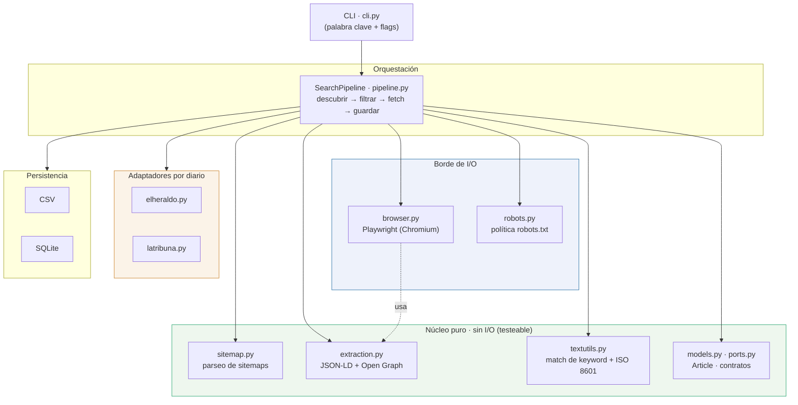
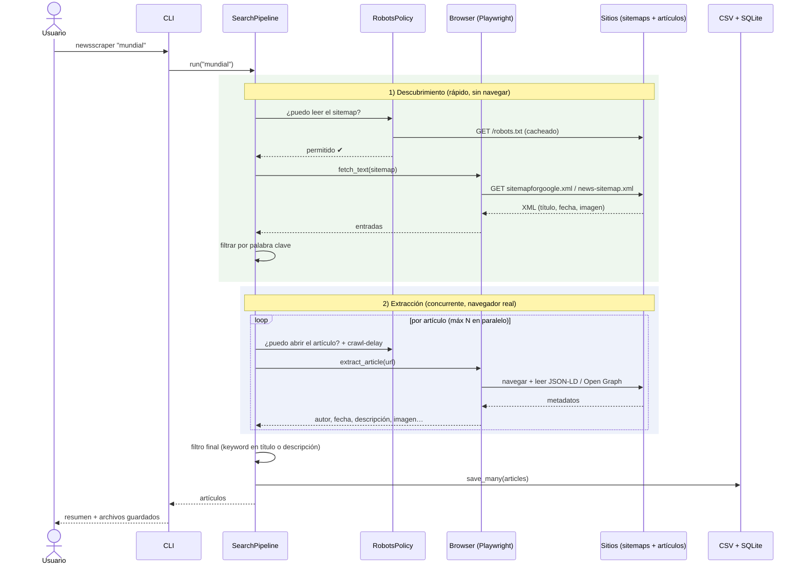
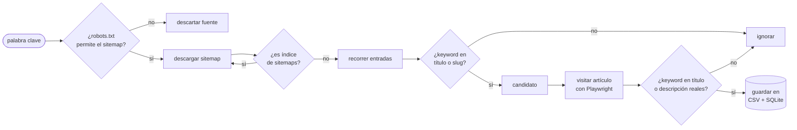

# newsscraper — Búsqueda de noticias por palabra clave

Scraper de noticias **asíncrono y modular**, construido con **Playwright**, que busca
artículos por una **palabra clave** en dos diarios hondureños —**El Heraldo** y
**La Tribuna**— y guarda los resultados en **CSV y SQLite**.

> Resuelve el ejercicio _"Web Scraping de Noticias"_ e implementa **todos los bonus**:
> Playwright, concurrencia/asincronía y empaquetado en Docker.

---

## Qué hace

Dada una palabra clave (por ejemplo `mundial`), el scraper:

1. **Descubre** artículos candidatos leyendo los _sitemaps_ que cada diario publica.
2. **Filtra** por palabra clave (sin distinguir mayúsculas ni acentos).
3. **Visita** con un navegador real (Chromium vía Playwright) solo los artículos que
   coinciden, en **paralelo**.
4. **Extrae** de cada noticia: autor, fecha (ISO 8601), título, descripción, imagen
   principal y URL.
5. **Guarda** todo en `data/articles.csv` y `data/articles.sqlite`.

---

## La decisión de diseño más importante: respetar `robots.txt`

El ejercicio pide **respetar `robots.txt`**. Al leer el de cada sitio encontré algo clave:

| Diario     | Regla en `robots.txt`               | Implicación                            |
| ---------- | ----------------------------------- | -------------------------------------- |
| El Heraldo | `Disallow: /busquedas/`, `/search/` | El **buscador está prohibido**         |
| La Tribuna | `Disallow: /?s=`                    | El **buscador de WordPress prohibido** |

Raspar el buscador habría **violado la regla que el propio ejercicio pide cumplir**.
La solución correcta —y más robusta— es usar lo que **ambos sitios sí permiten y
publican**: sus **sitemaps en formato Google News**, que traen título, fecha e incluso
la imagen. Así filtro por palabra clave _antes_ de gastar una sola visita, y solo
abro el navegador en los artículos que ya coinciden.

```text
 Buscador del sitio  → prohibido por robots.txt → NO se usa
Sitemap Google News → permitido y publicado    → fuente de descubrimiento
```

Además, **cada URL** (sitemap o artículo) pasa por un control de `robots.txt` antes de
ser solicitada. Es scraping respetuoso y eficiente a la vez.

---

## Arquitectura

Diseño **hexagonal**: el núcleo (lógica pura, sin red ni navegador) no depende del
framework. Playwright vive solo en el borde de I/O, lo que hace el núcleo
100% testeable sin abrir un navegador.



---

## Flujo de una búsqueda



---

## Cómo se descubren y filtran los artículos



---

## Estructura del proyecto

```
prueba-tecnica-ruth/
├── src/newsscraper/
│   ├── cli.py            # interfaz de línea de comandos (argparse)
│   ├── config.py         # configuración por variables de entorno
│   ├── pipeline.py       # orquestación: descubrir → filtrar → fetch → guardar
│   ├── models.py         # Article, SitemapEntry (estructuras de datos puras)
│   ├── ports.py          # contratos: SiteAdapter, ArticleRepository
│   ├── sitemap.py        # parseo de sitemaps (núcleo puro)
│   ├── extraction.py     # JSON-LD + Open Graph (núcleo puro)
│   ├── textutils.py      # match de keyword + normalización ISO-8601 (núcleo puro)
│   ├── robots.py         # política de robots.txt (borde de I/O)
│   ├── browser.py        # ciclo de vida de Playwright (borde de I/O)
│   ├── sites/            # un adaptador por diario
│   │   ├── elheraldo.py
│   │   ├── latribuna.py
│   │   └── registry.py
│   └── storage/          # repositorios CSV + SQLite + compuesto
├── tests/                # 33 tests offline (sin red, sin navegador)
├── Dockerfile            # imagen oficial de Playwright
├── docker-compose.yml
├── Makefile              # atajos cómodos
├── pyproject.toml        # dependencias y empaquetado
└── .env.example          # variables de configuración
```

---

## Cómo ejecutarlo

### Opción A — Docker (recomendada)

No necesitás Python ni instalar navegadores: la imagen oficial de Playwright ya
trae Chromium y sus librerías.

```bash
# 1) Construir la imagen
docker compose build           # o:  make docker-build

# 2) Buscar una palabra clave (los archivos quedan en ./data)
docker compose run --rm scraper "mundial"

# Ejemplos con flags
docker compose run --rm scraper "elecciones" --site latribuna --max-articles 30
docker compose run --rm scraper "economia"  --include-archive
```

Sin Compose:

```bash
docker build -t newsscraper .
docker run --rm -v "$PWD/data:/app/data" newsscraper "mundial"
```

### Opción B — Local (Python 3.11+)

```bash
python -m venv .venv "&" source .venv/bin/activate
pip install -e ".[dev]"
python -m playwright install --with-deps chromium   # descarga el navegador

python -m newsscraper "mundial"
# o, si lo dejás sin argumento, te lo pide de forma interactiva:
python -m newsscraper
```

---

## Uso del CLI

```
newsscraper [PALABRA_CLAVE] [opciones]

  -s, --site {elheraldo,latribuna}   Diario a buscar (repetible). Default: todos.
  -f, --format {csv,sqlite,both}     Backend de salida. Default: both.
      --output-dir DIR               Carpeta de salida. Default: data.
      --output-name NAME             Nombre base de los archivos. Default: articles.
      --max-articles N               Máximo de artículos a extraer. Default: 40.
      --concurrency N                Páginas en paralelo. Default: 4.
      --delay SEGUNDOS               Pausa educada por petición. Default: 1.0.
      --include-archive              Recorre también los sitemaps históricos (más lento).
      --headed                       Navegador visible (por defecto headless).
      --log-level {DEBUG,INFO,...}   Nivel de logs. Default: INFO.
      --list-sites                   Lista los diarios soportados y sale.
```

**Ejemplos**

```bash
newsscraper "selección honduras"          # ambos diarios, CSV + SQLite
newsscraper mundial -s elheraldo -f csv    # solo El Heraldo, solo CSV
newsscraper crisis --concurrency 8 --delay 0.5
```

---

## Configuración

Todo se configura por variables de entorno (o un archivo `.env`; copiá `.env.example`).
Los flags del CLI tienen prioridad sobre las variables.

| Variable                          | Default | Descripción                           |
| --------------------------------- | ------- | ------------------------------------- |
| `NEWSSCRAPER_USER_AGENT`          | Chrome  | User-Agent enviado a los sitios       |
| `NEWSSCRAPER_HEADLESS`            | `true`  | Navegador headless                    |
| `NEWSSCRAPER_CONCURRENCY`         | `4`     | Páginas obtenidas en paralelo         |
| `NEWSSCRAPER_DELAY`               | `1.0`   | Pausa base (s) antes de cada artículo |
| `NEWSSCRAPER_JITTER`              | `0.5`   | Aleatoriedad añadida a la pausa       |
| `NEWSSCRAPER_NAV_TIMEOUT_MS`      | `30000` | Timeout de navegación por página      |
| `NEWSSCRAPER_MAX_ARTICLES`        | `40`    | Tope de artículos por corrida         |
| `NEWSSCRAPER_MAX_SITEMAP_ENTRIES` | `4000`  | Tope de entradas de sitemap a revisar |
| `NEWSSCRAPER_INCLUDE_ARCHIVE`     | `false` | Recorrer sitemaps históricos          |
| `NEWSSCRAPER_OUTPUT_DIR`          | `data`  | Carpeta de salida                     |
| `NEWSSCRAPER_LOCALE`              | `es-HN` | Idioma preferido                      |
| `NEWSSCRAPER_LOG_LEVEL`           | `INFO`  | Nivel de logging                      |

---

## Qué se extrae y dónde se guarda

Cada noticia se guarda con estas columnas (mismo esquema en CSV y SQLite):

| Campo          | Ejemplo                         | Origen                      |
| -------------- | ------------------------------- | --------------------------- |
| `source`       | `elheraldo`                     | adaptador del diario        |
| `title`        | `Selección de Honduras gana...` | JSON-LD → Open Graph        |
| `description`  | `La H venció con autoridad...`  | JSON-LD → Open Graph → meta |
| `author`       | `Redacción`                     | JSON-LD → meta (saneado)    |
| `published_at` | `2026-06-14T18:14:00-06:00`     | JSON-LD → meta (ISO 8601)   |
| `image_url`    | `https://.../lead.jpg`          | Open Graph → JSON-LD        |
| `url`          | `https://www.elheraldo.hn/...`  | sitemap                     |
| `keyword`      | `mundial`                       | búsqueda del usuario        |
| `scraped_at`   | `2026-06-16T20:45:00+00:00`     | momento de extracción       |

**Por qué JSON-LD primero:** los medios incrustan `schema.org/NewsArticle` en
`<script type="application/ld+json">` para SEO. Es **mucho más estable** que raspar
`<div>`s que cambian seguido. Open Graph y `<meta>` son el plan B. _(Detalle real
detectado: El Heraldo pone un path basura `/cronologia/-/meta/redaccion` en
`meta[name=author]`; por eso se prioriza el JSON-LD, que trae el autor correcto, y se
descartan los valores que parecen rutas.)_

---

## Cómo evita ser bloqueado

- **Respeta `robots.txt`** en cada URL (sitemaps y artículos), con caché por dominio.
- **No usa los buscadores** prohibidos: descubre vía sitemaps permitidos.
- **User-Agent realista** de navegador de escritorio (configurable).
- **Concurrencia limitada** por semáforo (`--concurrency`).
- **Pausas educadas** con _jitter_ aleatorio y respeto al `Crawl-delay` del sitio.
- **Navegador real** (Chromium) con locale, viewport y `Accept-Language` coherentes.
- **Timeouts y reintentos** con _backoff_ ante fallos transitorios.

---

```bash
# Local
pytest -q

# Dentro de Docker
make docker-test
```

---

## ➕ Cómo agregar otro diario

El diseño es _screaming architecture_: agregar un medio es **escribir un adaptador**,
nada más.

1. Creá `src/newsscraper/sites/midiario.py` con una clase que implemente
   `SiteAdapter` (sus sitemaps, cómo reconoce una URL de artículo y cómo saca texto
   del slug).
2. Registralo en `sites/registry.py`.

El pipeline, la extracción y el almacenamiento **no cambian**.

---

## Rendimiento y escalabilidad (bonus)

Cómo está optimizado hoy y cómo escalaría:

- **Filtrado barato primero:** se filtra por palabra clave usando el sitemap (título,
  fecha, imagen) **antes** de navegar. Solo se abre el navegador en lo que ya coincide.
- **Concurrencia con cota:** `asyncio` + semáforo extraen varias páginas a la vez sin
  saturar al sitio. Subir `--concurrency` acelera; bajarlo es más amable.
- **Idempotencia:** `url` es clave única (SQLite) y el CSV no duplica, así que se puede
  re-ejecutar sin ensuciar los datos.
- **Para escalar más:**
  - Repartir diarios/sitemaps entre _workers_ (cola tipo Redis/Celery) y centralizar el
    almacenamiento en Postgres.
  - _Caché_ de `ETag`/`Last-Modified` de sitemaps para procesar solo lo nuevo
    (scraping incremental).
  - Reusar páginas/contextos de Playwright y bloquear imágenes/fuentes para acelerar.
  - Programar corridas periódicas (cron) usando el sitemap de noticias, que ya está
    ordenado por fecha.

---

## Requisitos del ejercicio → implementación

| Requisito                                                 | Dónde                                             |
| --------------------------------------------------------- | ------------------------------------------------- |
| Buscar por palabra clave ingresada por el usuario         | `cli.py` (argumento o prompt) · `textutils.py`    |
| Autor, fecha (ISO 8601), título, descripción, imagen, URL | `extraction.py` · `models.py`                     |
| Guardar en CSV **o** SQLite                               | `storage/` (¡los **dos**!)                        |
| Código modular en funciones reutilizables                 | núcleo puro + adaptadores + ports                 |
| Evitar bloqueos (robots.txt, User-Agent, esperas)         | `robots.py` · `browser.py` · `pipeline.py`        |
| **Bonus:** Playwright                                     | `browser.py` (async API)                          |
| **Bonus:** concurrencia / asincronía                      | `pipeline.py` (`asyncio` + semáforo)              |
| **Bonus:** Docker con instrucciones claras                | `Dockerfile` · `docker-compose.yml` · este README |

---

## Limitaciones conocidas

- El **sitemap de noticias** trae lo más reciente (ideal para keywords de actualidad).
  Para buscar en el histórico, usá `--include-archive` (más lento).
- Si un medio cambia la estructura de sus sitemaps o su `schema.org`, hay que ajustar el
  adaptador correspondiente. El diseño aísla ese cambio a un solo archivo.

---

## Licencia

MIT.
